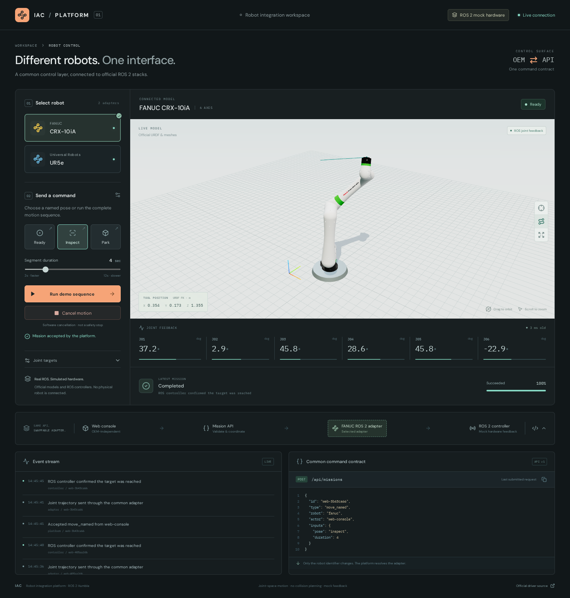
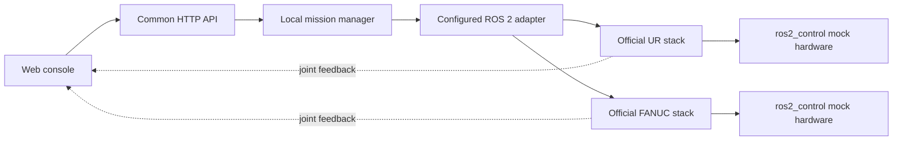

# IAC Robot Platform

One web console and one mission API for a **Universal Robots UR5e** and **FANUC CRX-10iA**, built on their official ROS 2 stacks. Select either arm, send the same command, and watch the official articulated model follow ROS joint feedback.

**Execution mode: ROS 2 mock hardware.** The ROS controllers execute trajectories over time. No physical robot, URSim or ROBOGUIDE is connected.



[Watch the recorded web demo (MP4)](frontend/screenshots/demo.mp4) · [Original WebM](frontend/screenshots/demo.webm) · [UR5e screenshot](frontend/screenshots/ur-desktop.png)

[Download the complete submission ZIP](https://github.com/psahay101/iac-ur-fanuc-integration-demo/releases/latest/download/IAC_UR_FANUC_Integration_Demo.zip) · [Release downloads](https://github.com/psahay101/iac-ur-fanuc-integration-demo/releases/latest)

The 30-second recording shows actual operation of this local demo. Download the video if your GitHub view does not display a player. The repository contains the complete source, tests and official assets; the submission ZIP also includes the prebuilt web interface.

## Run

Tested on Ubuntu 22.04, ROS 2 Humble, Python 3.10 and Node 24. Node 20.19+ or 22.12+ is needed for the frontend toolchain. ROS must be installed at `/opt/ros/humble`.

With the prerequisites below installed:

```bash
cd iac_robot_platform
bash scripts/setup.sh
bash scripts/run.sh
```

Open **http://localhost:8000**. Wait for “Both arms ready.” Ctrl+C stops the API and the two robot stacks. Logs are in `.runtime/logs/`. The launcher uses ROS domain **71**, localhost communication, and its own builds; it does not source unrelated workspaces. Set `IAC_ROS_DOMAIN_ID` before launch to choose another unused domain.

Setup builds the bundled, pinned OEM sources, exports their official URDF/meshes, installs Python packages into `.venv`, and builds the UI. It needs internet for Python/npm dependencies; the OEM source builds are offline. No vendor controller license or MoveIt installation is needed for this mock demo.

If you cloned the GitHub repository, enter its clone directory instead of `iac_robot_platform`; the setup and run commands are the same.

On an Ubuntu machine with the [ROS 2 Humble apt repository](https://docs.ros.org/en/humble/Installation/Ubuntu-Install-Debs.html) already configured, the build prerequisites are:

```bash
sudo apt install build-essential cmake python3-colcon-common-extensions \
  python3-venv python3-pip libeigen3-dev ros-humble-ros-base \
  ros-humble-ros2-control ros-humble-ros2-controllers \
  ros-humble-ur-client-library ros-humble-ur-msgs ros-humble-backward-ros \
  ros-humble-generate-parameter-library ros-humble-tf2-geometry-msgs \
  ros-humble-xacro ros-humble-robot-state-publisher \
  ros-humble-ament-cmake-gtest ros-humble-rosidl-default-generators
```

Install a supported Node version separately. FANUC's bundled compatibility patch expects the current Humble controller API (tested with `joint_trajectory_controller` 2.45.0); its setup script checks this before building.

## Try the platform

1. Select an arm. The catalog supplies its model, joint names, limits, poses and adapter endpoints.
2. Choose **Inspect**, **Park** or **Ready**, or **Run demo sequence** (Inspect → Park → Ready). The duration applies per waypoint.
3. Watch joint feedback, the calculated tool path and the controller-driven mission progress. Orbit and zoom the model, or expand it to fullscreen.
4. Cancel a move. The mission reports cancellation only after the ROS action confirms it.
5. Select the other arm and repeat. The command contract and controls stay the same. The request inspector shows the actual request or a clearly labelled preview.

The joint-target panel accepts degrees for readability and sends radians to the API. The event stream shows the request crossing the platform, adapter and controller boundaries. Both stacks run concurrently, so switching the view does not cancel an arm's active mission.

## Common interface

```json
{
  "id": "example-001",
  "type": "move_named",
  "robot": "ur",
  "actor": "web-console",
  "inputs": {"pose": "inspect", "duration": 4.0}
}
```

Send to `POST /api/missions`. Change `robot` to `fanuc` for the other arm. `actor` records the requester; it is not authentication. Other commands are `run_demo` and `move_joints`. Cancel with `POST /api/robots/{id}/stop`.

`GET /api/robots` exposes capabilities and model metadata. `WS /api/events` streams normalized robot states, missions and events at 10 Hz. Interactive API documentation is at **http://localhost:8000/docs**. See [API_CONTRACT.md](API_CONTRACT.md) for the complete contract.

## Where the responsibilities live



Feedback reaches the browser through the adapter and API WebSocket; the dashed arrows summarize that return path.

| Component | Owns |
| --- | --- |
| `frontend/src/` | Catalog-driven controls and generic URDF visualization. No OEM-specific behavior. |
| `backend/platform_api/app.py` | The site door: request contract, routing, WebSocket and assets. |
| `backend/platform_api/service.py` | Validation, pose/sequence resolution, one active mission per arm, results and bounded in-memory history. |
| `backend/platform_api/ros_adapter.py` | ROS joint-name mapping, controller readiness, trajectory actions, feedback and cancellation. |
| `config/*.json` | Model-specific joint limits, named poses, endpoints and display metadata. |
| `ros/*_mock.launch.py` | Headless composition using the official stacks' xacros and mock hardware paths. |
| `vendor/` | Pinned official driver/description sources and required dependencies, with licenses. |

Both OEMs expose `control_msgs/action/FollowJointTrajectory`. Therefore the platform uses **two configured instances of the same transport adapter**, rather than duplicating identical OEM subclasses. UR's official mock path uses the standard joint trajectory controller; FANUC's uses its official scaled trajectory controller. Each stack supplies its model and mock hardware configuration.

Adding a compatible robot means adding its configuration, assets and bringup. A stack with a different command protocol would implement the small `RobotAdapter` contract; the web console and mission API would remain unchanged.

For a top-down code walkthrough, read `app.py` → `service.py` → `ros_adapter.py`, then a config and its launch file. `scripts/run_demo.py` shows how the processes are assembled.

## Validation

```bash
bash scripts/test.sh
# With the app running, exercise both real ROS mock stacks via HTTP:
PYTHONNOUSERSITE=1 .venv/bin/python tests/integration.py
# Browser checks, after the one-time Chromium install:
cd frontend
PLAYWRIGHT_BROWSERS_PATH=../.runtime/browsers npx playwright install chromium
npm run test:e2e
```

See [VALIDATION.md](VALIDATION.md) for actual results and the optional controller-deactivation check. Tests use doubles only for unit isolation; the running demo and integration checks use ROS controllers and their feedback.

## Scope and limits

- Joint-space interpolation with configured position and velocity checks; **no collision checking, obstacle avoidance, IK planning, or physical safety guarantees**.
- Official mock hardware returns simulated state. Success confirms a ROS trajectory outcome, not physical motion or a manufacturing result. The tool-position display is forward kinematics from URDF and received joints, not a measured external pose.
- Progress comes from controller trajectory timing; completion comes from the action result. The browser never invents movement.
- Fresh joint messages and an active controller are required. Missing/stale state blocks new work; loss during execution requests cancellation. These are software checks, not an independent safety watchdog. Cancel is not an emergency stop.
- Results, deduplication and per-arm busy state live only in this API process. No durable recovery, fleet scheduling, cross-client ownership locks, deadlines, approval workflow or authentication. Bind is localhost for this demo.
- An unconfirmed trajectory outcome latches a fault and blocks further commands until the demo is restarted. A restart is not presented as a physical robot recovery procedure.
- Real hardware requires network/controller setup, vendor options and calibration, appropriate controllers and limits, safety integration and hardware validation. Replacing one file is not enough. Vendor communication protocols have not been tested here.

## Official sources

Sources are bundled to make the selected models reproducible. Repository histories and unrelated model assets are omitted; upstream notices are preserved. URDFs are generated from official xacro; mesh geometry is unchanged and browser URLs are rewritten for local serving.

| Source | Pinned commit |
| --- | --- |
| [Universal Robots ROS 2 Driver](https://github.com/UniversalRobots/Universal_Robots_ROS2_Driver) | `81b7b9c2adf884212173c70f1f962ac6e507b041` |
| [Universal Robots Description](https://github.com/UniversalRobots/Universal_Robots_ROS2_Description) | `43a3bfe4682e15680c087831e82e3527d2f48f8e` |
| [FANUC ROS 2 Driver](https://github.com/FANUC-CORPORATION/fanuc_driver) | `8f9f22e50f02042ded000440e305c7f6c820d5a2` |
| [FANUC Description](https://github.com/FANUC-CORPORATION/fanuc_description) | `fb40c9803a826ba68c7c8e28ba904a25efa7fcd2` |

`vendor/*/PINNED_SOURCE.json`, `vendor/fanuc_sources.json` and `assets/*/provenance.json` record source and asset provenance. FANUC dependency patches are OEM-supplied. The additional, recorded [Humble compatibility patch](ros/fanuc_humble_realtime_buffer.patch) adapts two flags to the installed controller API; it does not replace the OEM controller. Licenses are retained alongside the sources and exported assets.
